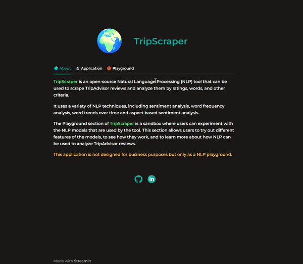

# TripScraper

Powered by Streamlit.

TripScraper is an open-source Natural Language Processing (NLP) tool that can be used to scrape TripAdvisor reviews and analyze them by ratings, words, and other criteria.
             
It uses a variety of NLP techniques, including sentiment analysis, word frequency analysis, word trends over time and aspect based sentiment analysis.

The Playground section of TripScraper is a sandbox where users can experiment with the NLP models that are used by the tool. This section allows users to try out different features of the models, to see how they work, and to learn more about how NLP can be used to analyze TripAdvisor reviews.

This application is not designed for business purposes but only as a NLP playground.

